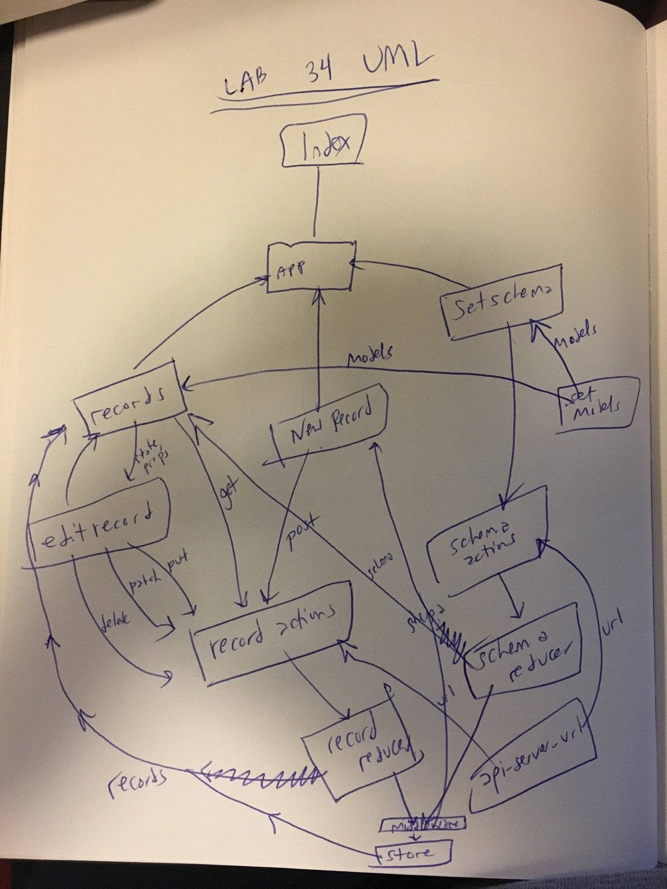

 LAB
=================================================

## Lab 34: Remote CRUD

### Author: Joseph Wolfe

### Links and Resources
* [GitHub](https://github.com/charmedsatyr-401-advanced-javascript/lab-34)
* [](https://travis-ci.com/charmedsatyr-401-advanced-javascript/lab-34) 
* [Netflify](https://adoring-raman-8fffa9.netlify.com/)

### Modules
```.
├── assets
│   └── uml.jpg
├── LICENSE
├── package.json
├── public
│   ├── favicon.ico
│   ├── index.html
│   └── manifest.json
├── README.md
├── src
│   ├── actions
│   │   ├── records-actions.js
│   │   └── schema-actions.js
│   ├── components
│   │   ├── app.js
│   │   ├── app.scss
│   │   ├── edit-record.js
│   │   ├── new-record.js
│   │   ├── records.js
│   │   └── set-schema.js
│   ├── index.js
│   ├── lib
│   │   ├── api-server-url.js
│   │   └── set-models.js
│   ├── middleware
│   │   └── reporter.js
│   ├── reducers
│   │   ├── records-reducer.js
│   │   ├── records-reducer.test.js
│   │   └── schema-reducer.js
│   └── store
│       └── index.js
└── yarn.lock

9 directories, 24 files
```

### Summary
The application uses asynchronous Redux actions to execute REST methods on a remote API. Records from the remote database are fetched and used to populate the `Records` component and the local store. The user can create a new record for a specific schema and then click "Edit" and "Delete" on the records to modify them; doing so will modify them in the remote database as well as in the local store.

All remote access is accomplished via the `fetch` built-in method in an asynchronous `action` for the appropriate reducer.

There are two reducers: `schema` and `records`. `schema` allows the user to toggle between different schemas (here, `teams` and `players`). `records` controls the records of a given schema type.

The remote API is set in `api-server-url.js`, which returns an object that dynamically matches the given API. This means that any changes to the remote API, or switching to a different remote server, will only require an update in that single file.

The schemas are set in `set-models.js`, which exports and object that accepts a parent and child schema names as values. The radio buttons at the top of the app, all the titles, and a good bit of other functionality is dynamically supported by the values in this object. The parent/child pattern was chosen because it is common: teams/players, categories/products, companies/employees, etc., would work. The view does not currently reflect the parent/child pattern well, and toggling to a different schema doesn't work properly because the `records` reducer uses a flat array rather than different object keys for records of different schema types, but these issues can be refactored away.

#### Tests
* What assertions were made?
  * Reducer REST methods have basic tests.

* What assertions need to be / should be made?
  * Snapshot and functional tests could be made for each component.
  * Tests could ensure each component properly calls `dispatch` with internal handlers.
  * Action creators and reducers could be further tested to ensure appropriate output.

#### UML

